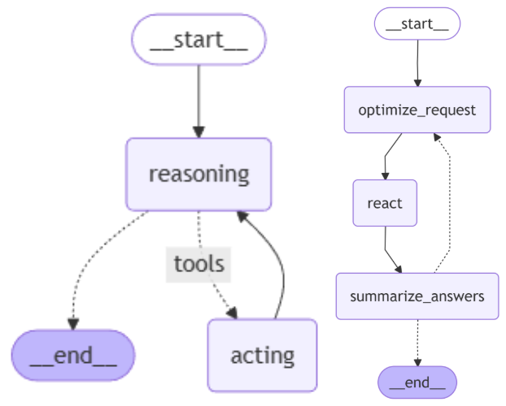

# 多模态智能体知识库系统

## 项目简介

本项目是一个功能强大的本地多模态知识库智能体系统，集成了先进的RAG（检索增强生成）技术、多模态检索能力和工具调用功能。系统基于LangChain和LangGraph框架构建，推理模型采用deepseek-v3，嵌入、重排序等采用开源模型实现高效的多模态信息处理和智能交互。

## ✨ 核心特性

### 🎯 **多模态能力**
- **图文互搜**：支持图像与文本之间的双向检索与理解
- **跨模态编码**：使用BAAI-AltCLIP进行多模态内容编码
- **统一表示**：将不同模态信息映射到同一语义空间（仅为多模态模式，对于长文本由优秀的嵌入模型嵌入实现RAG）

### 🔍 **智能检索系统**
- **混合检索策略**：
  - 文本检索：BAAI-bge-large-zh-v1.5
  - 重排序优化：BAAI-bge-reranker-base
  - 向量检索：Qdrant + 余弦相似度
- **多级精度优化**：从粗粒度到细粒度的完整检索流水线

### 🧠 **智能体架构**
- **推理引擎**：基于DeepSeek的智能推理
- **工具调用**：支持外部工具集成与调用
- **对话管理**：异步处理机制，实现高效并发

### 📚 **文档处理**
- **格式支持**：
  - 文档类型（需要特定软件打开，如PDF，DOCX）实现文字提取与结构分析保留格式信息
  - 纯文本文件（如txt）
  - 图像文件（JPG/PNG等）
- **智能分块**：
  - 段落感知分块：基于自然段落边界进行语义切分，保持文档结构完整性
  - 语义保持分块：基于字数的动态切分策略，在标点符号处智能截断，确保句子完整性
  - 上下文重叠：采用前后滑动窗口的字数叠加策略，避免语义断裂，维持上下文连贯性
  - 自适应分块：根据截断处附近的标点符号进行截断，确保语义完整，优化检索效果

## 🏗️ 技术架构

### 核心框架
- **LangChain/LangGraph**：组件化AI应用开发与工作流编排
- **HF Transformers**：本地化模型部署与推理加速
- **Qdrant**：高性能向量检索系统与相似度计算
- **Gradio**：友好的Web交互界面与实时流式响应

### 模型体系
```
多模态编码层 ── AltCLIP (BAAI)
    ├── 文本编码器
    └── 图像编码器

文本检索层 ── bge-large-zh-v1.5 (BAAI)
    ├── 稠密检索
    └── 语义匹配

重排序层 ── bge-reranker-base (BAAI)
    └── 精度优化

推理层 ── DeepSeek模型
    ├── 上下文理解
    ├── 工具调用决策
    └── 响应生成
```

### 数据存储
- **向量数据库**：Qdrant
- **度量方式**：余弦相似度
- **索引优化**：HNSW高效近邻搜索

## 🚀 快速开始

### 环境要求
- Python 3.10+
- CUDA 11.8+ (GPU推荐)
- 至少16GB RAM
- 足够存储空间用于模型缓存

### 使用步骤


1**安装依赖**
```
pip install -r requirements.txt
```

2**修改配置文件**
```
altclip = 你的路径
bge_encode= 你的路径
...
# 在config.toml中配置好你的参数
```

3. **构建知识库**
```
build_knowledge_base()
# 调用此函数构建知识库
```

4. **运行智能体**
```
chat_with_agent()
# 已封装成了一个函数，调用即可启动
```

##  🔧 功能


### 1. 多模态检索
- **文本检索**：输入问题获取相关文本片段
- **图文检索**：描述图片内容即可获取该图片的路径
- **混合检索**：结合图文信息的综合查询

### 2. 智能对话
- **知识问答**：基于知识库的精准回答
- **工具调用**：执行计算、搜索等操作
- **多轮对话**：上下文感知的持续交互


## 🎨 效果展示

Gradio界面适配了langchain智能体运行，交互体验较好，用langchain快速构建一个react智能体进行演示如何使用本地知识库


LangGraph与LangChain的主要区别在于对复杂状态管理和工作流编排的能力。LangChain更像是一个组件库和基础框架，提供模块化的AI功能组件；而LangGraph则是专门为构建复杂、有状态的智能体系统而设计的框架。
用langgraph构建一个更强大的智能体，主图内嵌套着一个子图（子图为react模型），如下图所示，左边为子图，右边为主图<br>

## 📊 性能特点

### 优势
- ✅ **完全本地化**：数据隐私安全
- ✅ **高效检索**：多级优化检索流水线
- ✅ **可扩展性**：模块化设计易于扩展
- ✅ **中文优化**：针对中文场景特别优化

### 技术指标
- 检索精度：>85% (MRR@10)
- 响应时间：<2秒（平均）
- 支持文档大小：单文件最大100MB


## 🛠️ 开发指南

### 项目结构
```
src/
├── agent/                    # 智能体主体
├── encoders/                 # 嵌入与编码器
├── retrieval/                # 用于多模态检索和重排序，rag                     
├── storage/                  # 向量数据库管理、知识库的构建与管理
├── ui/                       # 交互界面
├── utils/                    # 分块、解析等工具函数
└── main.py/                  # 应用入口
```

### 后续规划
1. **语义缓存优化**：集成Redis向量插件，实现毫秒级语义缓存响应
2. **历史对话管理**：保存对话历史，支持修改，方便后续对话
3. **部署方案完善**：添加容器化部署等


## 🙏 致谢

- [LangChain](https://github.com/langchain-ai/langchain)
- [LangGraph](https://github.com/langchain-ai/langgraph)
- [Hugging Face](https://huggingface.co/)
- [BAAI](https://www.baai.ac.cn/) (AltCLIP, BGE系列模型)
- [Qdrant](https://qdrant.tech/)
- [Gradio](https://www.gradio.app/)
- [DeepSeek](https://github.com/deepseek-ai) (推理模型)